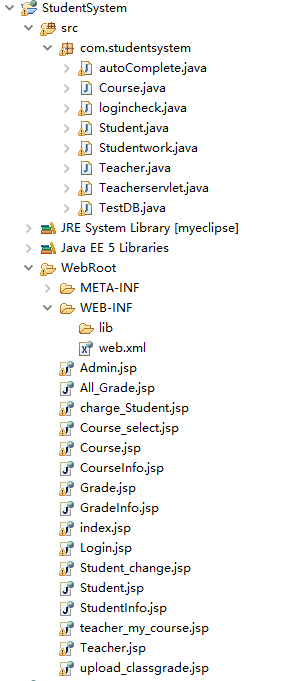
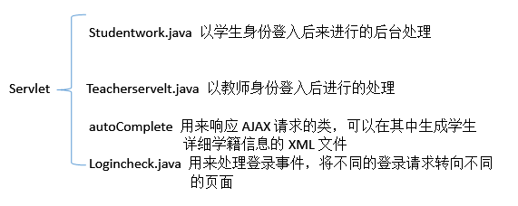
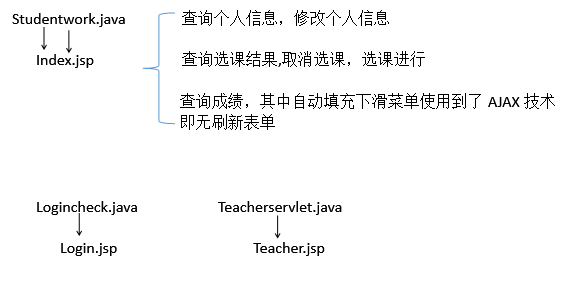
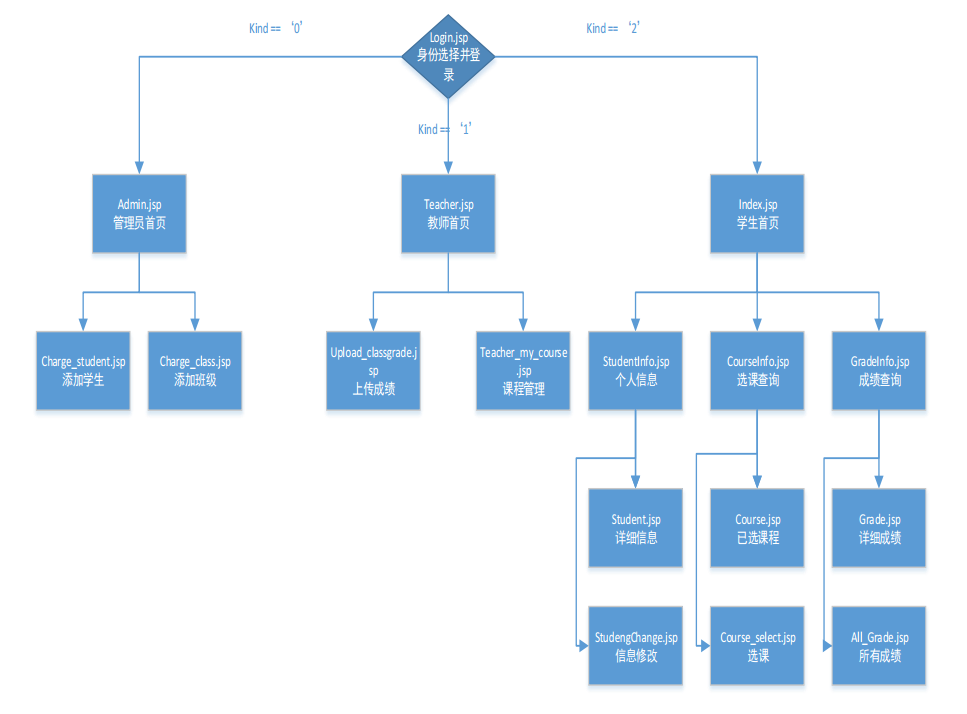
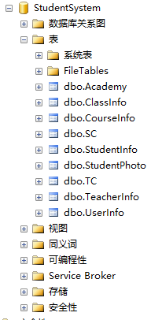
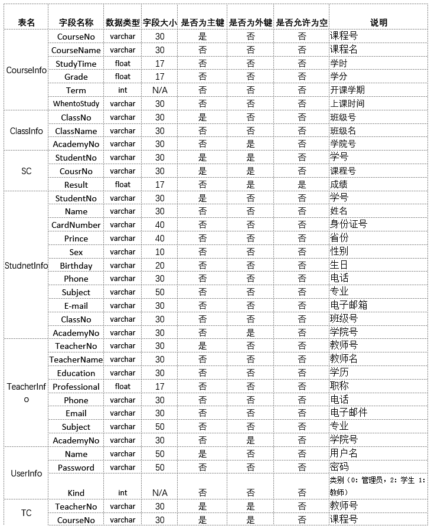

# schoolManagement
[TOC]  
## 项目简述  
本项目基于java语言开发，通过Apache Tomcat来搭建服务器端，使用Servlet，JSP开发服务器端程序，并使用SQLServer2014作为数据库服务器。基于JavaScript的Ajax技术实现网页交互内容。采用MVC开发模式。  
数据库开发采用SQLServer2014 平台，通过JDBC与java进行连接，可以通过Java程序实现数据库的操作。  
要求实现以下功能：  
(1) 制作学籍管理数据库  
(2) 编写服务器端实现对数据库中学籍信息的提取并构建学籍详细信息XML文件。  
(3) 编写静态学籍页面（内容为简单学籍信息）。  
(4) 编写AJAX程序实现对服务器端详细学籍信息提取结果的显示。  

## 项目整体架构  
学籍管理AJAX程序基于AJAX技术，实现了异步请求，不须等待服务器响应，发送请求后应用程序继续运行。用户仍可以在web表单中输入数据，甚至离开表单。在服务器端采用java语言，使用JavaWeb的知识开发程序。网页采用HTML+CSS+JavaScript开发。实现功能有：以管理员身份进行学生信息查询、修改、添加；以学生身份进行个人信息查询、选课查询、成绩查询、个人信息修改等；以教师身份进行课程查询。  
  
## 学籍管理系统结构示意图  
采用MVC模型，javabean做模型层，Jsp作为view层，servlet作为控制层。
- 目录说明  

主要功能包括setxxx，getxxx方法，用来保存信息和提取信息。  
还有TestDB.java用来处理数据库的相关操作.  

  
- 映射关系（Servlet逻辑事务处理和前端显示的对应关系）  
  
## 关键模块设计说明、流程图
### 关键模块设计说明
1.逻辑事务处理部分  
1)Studentwork.java  
负责处理以学生身份登录的用户的事务，包括：个人信息查询，个人信息修改， 选课管理，成绩查询。其中在成绩查询部分使用了AJAX技术，实现了类似百度搜索的自动向下弹出匹配内容的功能。   
2)TeacherServlet.java  
负责处理以教师身份身份的用户的事务。包括：上传成绩，选课查询。其中选课查询部分使用了AJAX技术，实现了类似百度搜索的自动向下弹出匹配内容的功能。   
3)Logincheck.java  
用户登录检查。通过提取用户在登录表单中输入的用户名和密码，然后在数据库中查询，若身份、密码、用户名均匹配正常，则跳转到相应身份的网页。否则提示用户错误信息。  
4)TestDB.java    
数据库操作部分。负责处理上述Studentwork，TeacherServlet的后台数据库操作。包括学生信息修改，教师上传成绩处理，学生选课处理。  
5)autoComplete.java  
负责处理所用AJAX有关的请求，包括：学生查询课程自动匹配课程名，教师查询所教课程自动匹配课程名，管理员进行无刷新修改学生信息，管理员进行无刷新添加学生信息等。  
2.前端显示部分    
1) Grade.jsp  
学生角度查询成绩部分。负责通过查询课程名来实现查询成绩操作，此模块通过使用AJAX技术，实现了无刷新表单，通过JavaScript 的onkeyup事件的处理，每当有键盘按键弹上时，会触发响应的响应函数。响应函数里通过建立XMLHttpRequest对象，实现异步处理，即用户不会一直等待服务器端的响应。  
2) Course_Select.jsp  
学生角度进行选课部分。负责学生的选课事务处理。通过显示课程的具体信息，来引导学生选课。使用Session来传递数据，课程信息保存在Course JavaBean中通过Arraylist显示。学生的选课结果将通过Session回传。  
3) teacher_my_course.jsp  
教师身份显示选课结果部分。负责提取数据库中TC表中信息来显示教师所教课程。  
4) update_classgrade.jsp  
教师身份上传成绩部分。此模块的查询课程使用了AJAX技术，通过监听onkeyup事件，实现课程名的自动匹配。  
5) charge_Student.jsp  
管理员身份处理学生各项信息部分。此模块的查询学生操作，删除学生操作，修改学生信息操作，添加学生操作均采用AJAX技术。通过在autoComplete中构建详细学籍信息XML文件，在该页面实现XML文件的解析，将各项内容显示出来。
因为使用AJAX技术，所以实现了无刷新页面即可更新信息的操作。  
### 流程图

## 数据库
### 数据库构建
 CourseInfo------课程表：存储课程相关信息  
 ClassInfo---------班级表：存储班级相关信息  
 SC------------------学生选课表：存储学生选课信息  
 StudnetInfo------学生表：存储学生相关信息  
 TC-------------------教师课程表：存储教师和所教课程的信息  
 TeacherInfo-------教师表：存储教师相关信息  
 UserInfo-----------用户登录表：存储登录用户信息  
 

### E-R图

### 数据库各张表的说明

### 数据库表之间的关系如下

## 设计总结与心得体会
设计过程中遇到的问题及解决方法  
1. Tomcat无法正常启动  
Tomcat安装完成后，无法启动。通过查询资料，原因是配置文件中端口设置存在问题。在配置文件中修改端口为8080后则可以正常使用。  
2. 数据库连接失败  
采用SQLServer2014来构建后台数据库，使用JDBC连接数据库和程序。但是会抛出异常表示无法连接数据库。原因是没有开启数据库远程登录服务，需要占用1433端口。通过在数据库配置软件里开启服务之后，并在相应的数据库和表中设置合理的权限，则可以正常使用数据库。  
3. AJAX使用中无法显示Web服务器端构建的XML文件中的内容  
通过在服务器端使用outprintln构建XMLHttpRequest的响应XML文件来实现数据信息的传递，但是在相关页面上无法正常显示。原因：数据解析后显示方式不正常，没有设置XML元素的firstChild.data，则无法正常显示。  
4. 取消选课后，被取消的课仍在选课结果中  
以学生身份进行选课操作，会展现给学生选课结果，若取消选课则进行相关操作即可，但是取消的课程仍保留在选课结果中。原因：在选课、取消选课的事务逻辑上没有搞清楚，调理模糊。解决方法：取消选课后，将对应的课程从SC表中删除，并每次更新Session中选课结果，同时注意循环处理中循环变量的值，应为每减少一个则会导致课程个数改变。  
5. 页面居中与定位问题  
对父元素使用相对定位（position:relative），对未设置宽度的子元素使用绝对定位（position:absolute）再加上left:50%;margin-left:-<子元素宽度的一半>,则可以对该子元素进行水平居中。Position定位有以下几种情况：  
1) Static流动定位    
2) Relative相对定位：相对定位依然参与流动定位的计算原来占用位置依然保留，在新位置浮在顶层    
3) Absolute绝对定位 ：绝对定位不参与流动定位的计算 ，原来占用位置空出，在新位置浮在顶层 ，定义了绝对定位的对象，会往上面父对象一层层寻找未定义static（预设）的对象，然后用这个对象作为定位基准。若没有找到，则使用浏览器对象作为绝对定位基准    
4) Fixed固定定位 ：始终以浏览器窗口为定位基准  
6. 数据库登录失败  
使用JDBC连接MyEclipse与数据库的时候，一直在MyEclipse中报错，在网页中登录时也没有接收到相应的数据，因此，我开始检查数据库配置，发现在数据库配置中无法使用自己建立的账户或者SA账号登录，导致了连接失败，错误提示“sql server 2008启动时：已成功与服务器建立连接，但是在登录过程中发生错误。(provider:命名管道提供程序，error:0-管道的另一端上无任何进程。)(Microsoft SQL Server,错误:233)”，在网络上查找有关问题，尝试了以下解决方案：  
打开SQL Server Management Studio Express，   
右键点击服务器，选择Properties(属性),在弹出窗口中点击Security(安全)切换到安全面板，
将server authentication服务器认证从windows authentication mode（windows用户认证模式）
修改为Sql Server and Windows Authentication mode（Sql server和windows认证模式）
先在服务器名称处填写数据库服务器IP，然后.身份验证处选择SQL Server身份验证，使用SA登录，登录Management Studio后，执行语句ALTER ENDPOINT [TSQL Local Machine] STATE=STARTED，重新原来的登录。
始终没有解决问题，最终重新安装Sqlsever2014,并会从新配置解决了问题。  
7. 图片显示异常  
服务器运行正常以及数据库连接正常的情况下，打开网页后，图片显示异常问题，改用Chrome内核后，图片显示正常。  

通过这次项目的编写，我明白了B/S模式的开发过程。在Web服务器端构建后台逻辑处理，在前端页面使用JavaScript技术提高交互性。同时，通过数据库的构建也使我明白了合理的数据库对整个系统的重要性。AJAX技术的使用，使B/S模式下的Web应用更加类似桌面应用程序。桌面应用程序的响应速度很快，AJAX技术就是尝试把桌面应用程序的交互性应用到web应用程序中，从而提高网络的用户体验。 

## 参考文献
1. JavaWeb整合开发与项目实战，徐明华 等著，人民邮电出版社  
2. 网络程序设计，方敏，张彤著，西安电子科技大学出版社  
3. 《UNIX环境高级编程》（第2版），史蒂文斯著，人民邮电出版社  
4. Java核心技术，Cay S.Horstmann,Gary Cornell著，机械工业出版社  
